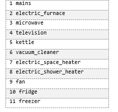

#

# SET OF DATASETS SUITABLE FOR NILM AT THE UNIVERSITY OF ALMERIA# SET OF DATASETS SUITABLE FOR NILM AT THE UNIVERSITY OF ALMERIA

#
In this repository we present five new datasets of electrical measurements including the electrical measurements including the aggregation of these in the H5 format used in the NILMTK format used in the NILMTK tool.

The new datasets are as follows:

-   **DSUALM:** measurements of seven OZM (OpenZmeter) v1 meters, whose measurements are associated with the aggregate and with that of 6 applications.

-   **DSUALMH**: measurements of seven OZM meters (OpenZmeter) v1, whose measurements are associated with the aggregate and 6 applications. This dataset also includes harmonics up to order 150 of voltage, current and power.

-   **DSUALM10**: Se han realizado mediciones con siete medidores OZM (OpenZmeter) v2, cuyas medidas se asocian al agregado y a diez aplicaciones.

-   **DSUALM10H**: Se han realizado mediciones con siete medidores OZM (OpenZmeter) v2, cuyas medidas se asocian al agregado y al de diez aplicaciones. En este conjunto de datos también se incluyen los armónicos de tensión, corriente y potencia hasta el orden 150.

-   **UALM2:** Mediciones de seis medidores OMPM (Open Multi Power Meter) v1, cuyas medidas se asocian al agregado y a cinco aplicaciones.

The composition of these datasets is described in more detail below.

## DSUALM y DSUALMH

En febrero de 2022, se desarrolló el nuevo conjunto de datos DSUALM (Data Set de la Universidad de Almería), que se creó a partir de las mediciones de siete medidores OpenZmeter v1, cuyas medidas se asocian al agregado y a seis aplicaciones. Este contador de electricidad y analizador de calidad de energía (OZM), empleado para crear este conjunto de datos, ha sido desarrollado en colaboración con las universidades de Granada y Almería, y funciona según los principios de código abierto y hardware abierto. Mide parámetros eléctricos a alta frecuencia (15 625 Hz), como frecuencia, corriente, potencia activa, factor de potencia, potencia aparente y potencia reactiva, entre otros.

### DESCARGAS DE LOS DATASETS 
-DSUALM can be downloaded from the repository (https://github.com/crn565/DSUAL_without-armonics) at:
https://github.com/crn565/DSUAL_without-armonics/blob/main/dsual.h5

-DSUALMH can be downloaded compressed from the repository (https://github.com/crn565/DSUALMH_OZM) in two parts:
https://github.com/crn565/DSUALMH_OZM/blob/main/dsualmh.part1.rar
https://github.com/crn565/DSUALMH_OZM/blob/main/dsualmh.part2.rar

## DSUALM10 y DSUALM10H

In June 2023, DSUALM10H (University of Almeria Dataset of 10 household appliances with harmonics) was developed , which as its name suggests expanded the initial version with 10 appliances. This new dataset includes 150+ electrical measurements with I, V and W transients, using the new version of the high-precision OpenZmeter v2 for 
 greater accuracy.In June 2023, DSUALM10H (University of Almeria Dataset of 10 household appliances with harmonics) was developed , which as its name suggests expanded the initial version with 10 appliances. This new dataset includes 150+ electrical measurements with I, V and W transients, using the new version of the high-precision  OpenZmeter v2 for greater accuracy.

The three three-phase OZM v2 devices used to generate this dataset provide a total of twelve measurement channels, one of which is reserved for aggregation of the rest. The use of the OZM API was vital for acquiring operational data from multiple devices over extended periods of time. However, some fields required adaptation for integration with NILMTK, which ensured accurate recording of consumption data and storage of metadata in the new dataset.The three three-phase OZM v2 devices used to generate this dataset provide a total of twelve measurement channels, one of which is reserved for aggregation of the rest. The use of the OZM API was vital for acquiring operational data from multiple devices over extended periods of time. However, some fields required adaptation for integration with NILMTK, which ensured accurate recording of consumption data and storage of metadata in the new dataset.

The primary IP X.X.X.X.100 meter (channel 1) was used for the aggregate measurements, while the other ten devices used the remaining channels to record time stamp, power, reactive power, frequency, voltage, power factor, current data and harmonics up to the order of 50 for each device, as shown in the picture.

### DESCARGAS DE LOS DATASETS 

-DSUALM10 can be downloaded from the repository (https://github.com/crn565/10_APLICATIVOS_SIN_ARMONICOS):
https://github.com/crn565/10_APLICATIVOS_SIN_ARMONICOS/blob/main/dsual.h5

-DSUALM10H can be downloaded compressed in four parts from the repository (https://github.com/crn565/DSUALM10H_OZM):
https://github.com/crn565/DSUALM10H_OZM/blob/main/dsualmh.zip.001
https://github.com/crn565/DSUALM10H_OZM/blob/main/dsualmh.zip.002
https://github.com/crn565/DSUALM10H_OZM/blob/main/dsualmh.zip.003
https://github.com/crn565/DSUALM10H_OZM/blob/main/dsualmh.zip.004

## UALM2

OMPM10 (Open Multi Power Meter), was developed in 2023 from 6-channel measurements (5+added) using a novel system based on a single ESP32 microcontroller, a microSD card reader, an I2C display and 6 PZEM004 measurement modules, all operating on an RS485 bus. The 6 measurement modules are associated respectively to the main meter and to the five devices that were selected for their low power consumption (Fryer, LED Lamp, Incandescent Lamp, Laptop Computer, Fan).

### DESCARGAS DEL DATASET 

-UALM2 can be downloaded from the repository (https://github.com/crn565/OMPM) at:
https://github.com/crn565/OMPM/blob/main/ualm2.h5

#

# NEW CONVERTERS# NEW CONVERTERS

# 

Since the different measurement files obtained with oZm v1, oZm v2 and the OMPM must be processed in csv format in the previous phase (see notebooks in Jupyter corresponding to phase one for each Dataset), we need to transfer them to a single optimised file in HDF5 (or simplifying H5) format , which we store in the "/data/" folder.
Furthermore, it is worth noting that each H5 file that we generate from the measurement files will not only contain the collected measurements that we are interested in for each meter, but also all the metadata of the new dataset.Since the different measurement files obtained with oZm v1, oZm v2 and the OMPM must be processed in csv format in the previous phase (see notebooks in Jupyter corresponding to phase one for each Dataset), we need to transfer them to a single optimised file in  HDF5 (or simplifying H5) format
, which we store in the "/data/" folder.  

Furthermore, it is worth noting that each H5 file that we generate from the measurement files will not only contain the collected measurements that we are interested in for each meter, but also all the metadata of the new dataset.

Likewise, depending on the version of oZm, the number of applications, and whether harmonics are to be processed, we will generate 4 new datasets: two new datasets (with or without harmonics) for oZm v1 with 5 applications plus the aggregate and two other new datasets (with or without harmonics) for oZm v2 with 10 applications plus the aggregate. Similarly for the OMPM as it does not support harmonics we will create only one new dataset with 5 applicatives plus the aggregate.Likewise, depending on the version of oZm, the number of applications, and whether harmonics are to be processed, we will generate 4 new datasets: two new datasets (with or without harmonics) for oZm v1 with 5 applications plus the aggregate and two other new datasets (with or without harmonics) for oZm v2 with 10 applications plus the aggregate. Similarly for the OMPM as it does not support harmonics we will create only one new dataset with 5 applicatives plus the aggregate.

NILMTK uses standardised dataset formats (see section 2.8 entitled "Public DS"), but given the exclusivity of the data offered by both versions of oZm (and later OMPM), we required a new data format, for which we created 4 new functions to generate the different datasets*. *  As we can intuit, these new converters, although based on the IAWE converter, contain major differences because 13-digit timestamp support has been included, as well as new measurements and they also differ in the harmonics support, and in the number or type of appliances
supported.

These new functions that will generate the new datasets, in case our computer has Windows 11 (or Windows 10) and we have installed both Anaconda and NILMTK, will be located in new directories in the path:
*"/Users/Usuariox/anaconda3/envs/NILMTK-env/Lib/site-packages/nilmtk/data-converters/".*".

In these directories, besides housing the *Python* code of the new converters, we must also include a new subdirectory called "*/metadata/"*, which includes the metadata files.

To support the new converter, in the mentioned path we include the file *convert_ualm.py*, file where we will contain the code of the new converter that will process the oZm files (in the example oZm
v1 without harmonics support).In these directories, besides housing the *Python* code of the new converters, we must also include a new subdirectory called "*/metadata/"*, which includes the metadata files.

In the case of needing to process harmonics, analogously to the treatment without harmonics, we will create the directory
*"/Users/Usuariox/anaconda3/envs/NILMTK-env/Lib/site-packages/nilmtk/data-converters/ualm5t "*
and we will replicate the previous structure, but including *convert_ualmt.py*, (among other files), whose task will be to process the oZm v1 files including harmonics (*convert_ualmt.py*).

On the other hand, in a similar way to the one mentioned above, in the case of oZm v2, when implementing a greater number and types of different household appliances, we will need a logic, very similar to the previous one (with or without harmonics support) but differentiated to process the
new measurements.

Regarding the processing of harmonics, both with the data provided by oZm v1 and with the data provided by oZm v2, generated by the measurement files, given that we are going to add new fields, we also have to modify the *Python* code of the converter in the *column_mapping,* list so that it processes the new fields.In the case of needing to process harmonics, analogously to the treatment without harmonics, we will create the directory
*"/Users/Usuariox/anaconda3/envs/NILMTK-env/Lib/site-packages/nilmtk/data-converters/ualm5t "*
and we will replicate the previous structure, but including *convert_ualmt.py*, (among other files), whose task will be to process the oZm v1 files including harmonics (*convert_ualmt.py*).

On the other hand, in a similar way to the one mentioned above, in the case of oZm v2, when implementing a greater number and types of different household appliances, we will need a logic, very similar to the previous one (with or without harmonics support) but differentiated to process the
new measurements.

Regarding the processing of harmonics, both with the data provided by oZm v1 and with the data provided by oZm v2, generated by the measurement files, given that we are going to add new fields, we also have to modify the *Python* code of the converter in the *column_mapping,* list so that it processes the new fields.The content of these three files shown in the previous image is very relevant, as they will allow us to incorporate the metadata contained in the dataset, as well as the types of measurements contained in the data files in *csv.* format.
Precisely, we can see more clearly the configuration of all the necessary files for the new converters, as well as the required directory structure.

Let's take a look at the contents of these files, for which, let's start by looking at the file *building1. yaml,* whose content we can see in the list in *yaml* format that, according to the converter, in this case ualm5, we will locate in the route "*C:\C:\Usersersuario\anaconda3\envs\\nilmtk-env\Librium\site-packages\nilmtk\dataset_converters\ualm5\metadata\building1. yam)*," where in this case the 5 devices plus the aggregate (all of type oZm v1), and the name of the electrical devices to which they are connected are configured.Let's take a look at the contents of these files, for which, let's start by looking at the file *building1. yaml,* whose content we can see in the list in *yaml* format that, according to the converter, in this case ualm5, we will locate in the route "*C:\C:\Usersersuario\anaconda3\envs\\nilmtk-env\Librium\site-packages\nilmtk\dataset_converters\ualm5\metadata\building1. yam)*," where in this case the 5 devices plus the aggregate (all of type oZm v1), and the name of the electrical devices to which they are connected are configured.

As we can deduce from the previous list we have 6 meters (all oZm v1), being number one the main one from the conceptual point of view (i.e. the general one or *Main*), and the rest, individualised meters connected to 5 different appliances.

It is easy to understand that this file is identical for the two converters used with oZm v1 (with or without harmonics) as both contain the same applications, but it is different from the files used in the converters to process the data coming from oZm v2 (with or without harmonics) as the number of applications is increased in this case.

If we visualise the content of the *dataset.yaml* file, in the list in *yaml* format, we can see how the rest of the metadata that may be of interest to the researcher are specified, such as the date, the geographic location or simply a contact method, metadata that we will obviously also associate to the dataset.As we can deduce from the previous list we have 6 meters (all oZm v1), being number one the main one from the conceptual point of view (i.e. the general one or *Main*), and the rest, individualised meters connected to 5 different appliances.

Es fácil deducir que este fichero es idéntico al del conversor con soporte con armónicos dado que parten de las mismas medidas, siendo además muy similar al usado con las medidas de oZm v2 (excepto en apartado referente a la fecha de publicación).

Por último, nos queda también en formato *yaml*, el fichero de medidas *meter_devices.yaml*. En éste hay diferencias acusadas tanto en las medidas obtenidas con oZm v1 o oZm v2 como en el soporte de armónicos, porque si bien comparten el número de medidas fundamentales soportadas por los diferentes oZm's (como son la potencia activa, aparente y reactiva, la frecuencia, el voltaje, la corriente y el factor de potencia) en los conjuntos de datos con soporte de armónicos añadiremos además 150 medidas correspondientes a los armónicos hasta el orden 50 de la tensión, corriente y potencia.

En este caso, al ser medidas idénticas las tomadas con oZm v1 y oZm v2, este fichero asociado, dado que está asociado al tipo de contador, este será idéntico en ambas versiones tan solo defiriendo en el soporte de armónicos al albergar estos ultimo un mayor número de medidas. Por tanto, es relevante destacar en este punto, como el fichero de medidas debe estar íntimamente relacionado con el convertidor de los ficheros de datos, razón por la cual, en esta Tesis, dado que buscamos evaluar la posible mejora del procesamiento de los armónicos en NILMTK,dispondremos para los datos aportados por oZm v1 y oZm v2 de diferentes  convertidores con todo su soporte necesario (función de conversión, ficheros de configuración, etc.)

Como ejemplo reproducimos en el listado el contenido para el caso de conversor de los datos apartados por oZm v1 sin soporte de armónicos.

Es fácil deducir que este fichero será idéntico al usado en el conversor para capturar los datos de oZm v2 sin armónicos. Además de forma parecida en el caso de soporte con armónicos tanto para oZm v1 como oZm v2 el contenido de este fichero será aún mucho más extenso al incluir además 150 variables correspondientes a los 50 armónicos de tensión, corriente y potencia.

**Ampliación del soporte de nuevos conversores a NILMTK**

Es necesario destacar, que como el formato original de NILMTK para el campo *timestamp* es de 10 dígitos, pero el *timestamp* arrojado por el OZM está en formato 13 dígitos (es decir, en el que se almacena hasta los milisegundos pasados desde el 1 del 1 de 1970). Es por ello que debemos realizar una adaptación especial, pues además este formato no es soportado por ningún conversor soportado por el toolkit. Es precisamente este importante cambio, en el formato de *timestamp* de 10 a 13 dígitos, uno los motivos por el que se requieren nuevos convertidores específicos para el procesamiento de las medidas arrojadas por los oZm's en sus diferentes versiones, además de otros factores secundarios (como, por ejemplo, el cambio del valor de *timezone* para nuestra ubicación de *Europe/Madrid).*

Además, respecto a los metadatos que se van a tratar en los diferentes convertidores, estos difieren, dado que algunos soportan solo la potencia (real, reactiva y aparente), el voltaje, la intensidad, la frecuencia y el factor de potencia, pero en otros además añadimos los armónicos hasta el orden 50 de la corriente, tensión y potencia.

Como cada fichero de medidas es obtenido en la fase anterior a partir de los ficheros de los diferentes oZm's, es necesario numerarlos del 1 al número de aplicativos máximo (6 en caso de oZm v1 y 11 en caso de oZm v2), siendo el Nº 1 el correspondiente al medidor principal y el resto
perteneciente a los submedidores asociados a los aparatos eléctricos.
Para ello, cada nueva función accede a todos los citados ficheros de datos de medidas localizados en la carpeta de entrada "/*electricity/",* usando para ello el fichero de etiquetas *labels.csv,* proceso que representamos en la siguiente figura.

> 

Obviamente, al contenido del fichero *labels.dat* dependerá de los electrodomésticos que hayamos conectado en el experimento en particular, pero, en todo caso, es muy importante este fichero, ya que ubica cada fichero *csv* numerado con su aplicativo (por ejemplo, el fichero *1.csv*, que corresponde a la primera línea, corresponde a *mains*, es decir al contador principal).

En el caso de los datos ofrecidos por oZm v2, la estructura de ficheros es muy similar a la vista con los datos de oZm v1, lógicamente con los cambios oportunos para soportar el doble de aplicativos, tal y como podemos ver en el siguiente esquema en la imagen.

Un ejemplo del contenido de este fichero, usado para las medidas tomadas con oZm v1 tanto con soporte o no de armónicos, se puede observar en la
Tabla.

En el caso las medidas tomadas con oZm v2 tanto con soporte o no de armónicos, al ampliar el número de aplicativos su contenido es diferente, como podemos ver en siguiente tabla.

En cuanto a los ficheros de datos (*1.csv, 2.csv, 3.csv, 4.csc, 5.csv, 6.csv*), salvando la primera fila que corresponde a los identificativos de los campos de las medidas, el resto de filas representa una medida en un determinado instante temporal definido por su valor de *timestamp**.*

En nuestro caso, el valor del *timestamp* está fijado al formato Unix Epoc de 13 dígitos, a diferencia del formato convencional de NILMTK que está fijado en 10 dígitos, **siendo este trabajo uno de los primeros trabajos relacionados con NILMTK en adoptar dicho formato, mucho más completo.**

Es de destacar que los ficheros de medidas deben estar de acorde, tanto con los ficheros de metadatos (en formato *yaml*), como con los propios datos en sí mismos (en formato csv).

Una vez ubicados los ficheros de medidas, lo primero es invocar el conversor especifico llamando a la nueva función *convert_ualm* (de modo similar se haría de forma similar con las correspondientes funciones específicas para el resto de datasets)*,* pasándole la ruta de los metadatos y el nuevo nombre del fichero del conjunto de datos que se generará en formato *H5*, como podemos hacer con el Listado en *Python*.

Es asimismo importante mencionar para que, tanto los ficheros de metadatos como el código en *Python* de cada convertidor sean procesados por el toolkit, debemos añadir nuevas líneas en el fichero \_\_init\_\_ con los 5 nuevos conversores soportados, tal y como podemos apreciar en la imagen.

En cuanto al fichero "\_\_init\_\_\_", este decisivo fichero en formato yaml lo localizaremos en la ruta: *"/Users/Usuariox/python3/envs/NILMTK-env/Lib/site-packages/NILMTK/data-converters/\_\_init\_\_",* y su contenido los podemos ver a continuación.

En este fichero, es de destacar las últimas nuevas líneas de código,donde contemplamos el soporte de los nuevos convertidores:

-   *convert_ualm* que usaremos para el procesamiento de los datos     provenientes de varios oZm v1 sin registrar armónicos con 5     aplicativos (Línea 15).

-   *convert_ualmt,* que contempla 5 aplicativos, pero además de los     campos mencionados, los armónicos hasta el orden 50 de la tensión,
    la corriente y la potencia (Línea 16)

-   *convert_ualm10* que usaremos para el procesamiento de los datos    provenientes de varios oZm v2 sin registrar armónicos con 10
    aplicativos (Línea 17)

-   *convert_ualm10H,* que contempla 10 aplicativos, pero además de los     campos mencionados, los armónicos hasta el orden 50 de la tensión,
    la corriente y la potencia (Línea 18)

-   *convert_ualm2* para procesar las medidas del nuevo hardware      OMPM(Línea 19).
