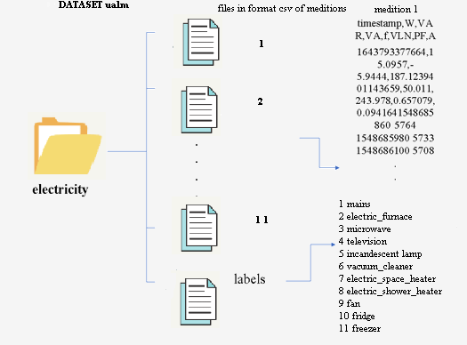

#

# SET OF DATASETS SUITABLE FOR NILM AT THE UNIVERSITY OF ALMERIA

#
In this repository we present five new datasets of electrical measurements including the electrical measurements including the aggregation of these in the H5 format used in the NILMTK format used in the NILMTK tool.

The new datasets are as follows:

-   **DSUALM:** measurements of seven OZM (OpenZmeter) v1 meters, whose measurements are associated with the aggregate and with that of 6 applications.

-   **DSUALMH**: measurements of seven OZM meters (OpenZmeter) v1, whose measurements are associated with the aggregate and 6 applications. This dataset also includes harmonics up to order 150 of voltage, current and power.

-   **DSUALM10**: Se han realizado mediciones con siete medidores OZM (OpenZmeter) v2, cuyas medidas se asocian al agregado y a diez aplicaciones.

-   **DSUALM10H**: Se han realizado mediciones con siete medidores OZM (OpenZmeter) v2, cuyas medidas se asocian al agregado y al de diez aplicaciones. En este conjunto de datos también se incluyen los armónicos de tensión, corriente y potencia hasta el orden 150.

-   **UALM2:** Mediciones de seis medidores OMPM (Open Multi Power Meter) v1, cuyas medidas se asocian al agregado y a cinco aplicaciones.

The composition of these datasets is described in more detail below.

## DSUALM y DSUALMH

En febrero de 2022, se desarrolló el nuevo conjunto de datos DSUALM (Data Set de la Universidad de Almería), que se creó a partir de las mediciones de siete medidores OpenZmeter v1, cuyas medidas se asocian al agregado y a seis aplicaciones. Este contador de electricidad y analizador de calidad de energía (OZM), empleado para crear este conjunto de datos, ha sido desarrollado en colaboración con las universidades de Granada y Almería, y funciona según los principios de código abierto y hardware abierto. Mide parámetros eléctricos a alta frecuencia (15 625 Hz), como frecuencia, corriente, potencia activa, factor de potencia, potencia aparente y potencia reactiva, entre otros.

### DOWNLOADS OF THE DATASETS
-DSUALM can be downloaded from the repository (https://github.com/crn565/DSUAL_without-armonics) at:
https://github.com/crn565/DSUAL_without-armonics/blob/main/dsual.h5

-DSUALMH can be downloaded compressed from the repository (https://github.com/crn565/DSUALMH_OZM) in two parts:
https://github.com/crn565/DSUALMH_OZM/blob/main/dsualmh.part1.rar
https://github.com/crn565/DSUALMH_OZM/blob/main/dsualmh.part2.rar

## DSUALM10 y DSUALM10H

In June 2023, DSUALM10H (University of Almeria Dataset of 10 household appliances with harmonics) was developed , which as its name suggests expanded the initial version with 10 appliances. This new dataset includes 150+ electrical measurements with I, V and W transients, using the new version of the high-precision OpenZmeter v2 for 
 greater accuracy.In June 2023, DSUALM10H (University of Almeria Dataset of 10 household appliances with harmonics) was developed , which as its name suggests expanded the initial version with 10 appliances. This new dataset includes 150+ electrical measurements with I, V and W transients, using the new version of the high-precision  OpenZmeter v2 for greater accuracy.

The three three-phase OZM v2 devices used to generate this dataset provide a total of twelve measurement channels, one of which is reserved for aggregation of the rest. The use of the OZM API was vital for acquiring operational data from multiple devices over extended periods of time. However, some fields required adaptation for integration with NILMTK, which ensured accurate recording of consumption data and storage of metadata in the new dataset.The three three-phase OZM v2 devices used to generate this dataset provide a total of twelve measurement channels, one of which is reserved for aggregation of the rest. The use of the OZM API was vital for acquiring operational data from multiple devices over extended periods of time. However, some fields required adaptation for integration with NILMTK, which ensured accurate recording of consumption data and storage of metadata in the new dataset.

The primary IP X.X.X.X.100 meter (channel 1) was used for the aggregate measurements, while the other ten devices used the remaining channels to record time stamp, power, reactive power, frequency, voltage, power factor, current data and harmonics up to the order of 50 for each device, as shown in the picture.

### DOWNLOADS OF THE DATASETS

-DSUALM10 can be downloaded from the repository (https://github.com/crn565/10_APLICATIVOS_SIN_ARMONICOS):
https://github.com/crn565/10_APLICATIVOS_SIN_ARMONICOS/blob/main/dsual.h5

-DSUALM10H can be downloaded compressed in four parts from the repository (https://github.com/crn565/DSUALM10H_OZM):
https://github.com/crn565/DSUALM10H_OZM/blob/main/dsualmh.zip.001
https://github.com/crn565/DSUALM10H_OZM/blob/main/dsualmh.zip.002
https://github.com/crn565/DSUALM10H_OZM/blob/main/dsualmh.zip.003
https://github.com/crn565/DSUALM10H_OZM/blob/main/dsualmh.zip.004

## UALM2

OMPM10 (Open Multi Power Meter), was developed in 2023 from 6-channel measurements (5+added) using a novel system based on a single ESP32 microcontroller, a microSD card reader, an I2C display and 6 PZEM004 measurement modules, all operating on an RS485 bus. The 6 measurement modules are associated respectively to the main meter and to the five devices that were selected for their low power consumption (Fryer, LED Lamp, Incandescent Lamp, Laptop Computer, Fan).

### DATASET DOWNLOADS

-UALM2 can be downloaded from the repository (https://github.com/crn565/OMPM) at:
https://github.com/crn565/OMPM/blob/main/ualm2.h5

#

# NEW CONVERTERS

# 

Since the different measurement files obtained with oZm v1, oZm v2 and the OMPM must be processed in csv format in the previous phase (see notebooks in Jupyter corresponding to phase one for each Dataset), we need to transfer them to a single optimised file in HDF5 (or simplifying H5) format , which we store in the "/data/" folder.
Furthermore, it is worth noting that each H5 file that we generate from the measurement files will not only contain the collected measurements that we are interested in for each meter, but also all the metadata of the new dataset.Since the different measurement files obtained with oZm v1, oZm v2 and the OMPM must be processed in csv format in the previous phase (see notebooks in Jupyter corresponding to phase one for each Dataset), we need to transfer them to a single optimised file in  HDF5 (or simplifying H5) format
, which we store in the "/data/" folder.  

Furthermore, it is worth noting that each H5 file that we generate from the measurement files will not only contain the collected measurements that we are interested in for each meter, but also all the metadata of the new dataset.

Likewise, depending on the version of oZm, the number of applications, and whether harmonics are to be processed, we will generate 4 new datasets: two new datasets (with or without harmonics) for oZm v1 with 5 applications plus the aggregate and two other new datasets (with or without harmonics) for oZm v2 with 10 applications plus the aggregate. Similarly for the OMPM as it does not support harmonics we will create only one new dataset with 5 applicatives plus the aggregate.Likewise, depending on the version of oZm, the number of applications, and whether harmonics are to be processed, we will generate 4 new datasets: two new datasets (with or without harmonics) for oZm v1 with 5 applications plus the aggregate and two other new datasets (with or without harmonics) for oZm v2 with 10 applications plus the aggregate. Similarly for the OMPM as it does not support harmonics we will create only one new dataset with 5 applicatives plus the aggregate.

NILMTK uses standardised dataset formats (see section 2.8 entitled "Public DS"), but given the exclusivity of the data offered by both versions of oZm (and later OMPM), we required a new data format, for which we created 4 new functions to generate the different datasets*. *  As we can intuit, these new converters, although based on the IAWE converter, contain major differences because 13-digit timestamp support has been included, as well as new measurements and they also differ in the harmonics support, and in the number or type of appliances
supported.

These new functions that will generate the new datasets, in case our computer has Windows 11 (or Windows 10) and we have installed both Anaconda and NILMTK, will be located in new directories in the path:
*"/Users/Usuariox/anaconda3/envs/NILMTK-env/Lib/site-packages/nilmtk/data-converters/".*".

In these directories, besides housing the *Python* code of the new converters, we must also include a new subdirectory called "*/metadata/"*, which includes the metadata files.

To support the new converter, in the mentioned path we include the file *convert_ualm.py*, file where we will contain the code of the new converter that will process the oZm files (in the example oZm
v1 without harmonics support).In these directories, besides housing the *Python* code of the new converters, we must also include a new subdirectory called "*/metadata/"*, which includes the metadata files.

In the case of needing to process harmonics, analogously to the treatment without harmonics, we will create the directory
*"/Users/Usuariox/anaconda3/envs/NILMTK-env/Lib/site-packages/nilmtk/data-converters/ualm5t "*
and we will replicate the previous structure, but including *convert_ualmt.py*, (among other files), whose task will be to process the oZm v1 files including harmonics (*convert_ualmt.py*).

On the other hand, in a similar way to the one mentioned above, in the case of oZm v2, when implementing a greater number and types of different household appliances, we will need a logic, very similar to the previous one (with or without harmonics support) but differentiated to process the
new measurements.

Regarding the processing of harmonics, both with the data provided by oZm v1 and with the data provided by oZm v2, generated by the measurement files, given that we are going to add new fields, we also have to modify the *Python* code of the converter in the *column_mapping,* list so that it processes the new fields.The content of these three files shown in the previous image is very relevant, as they will allow us to incorporate the metadata contained in the dataset, as well as the types of measurements contained in the data files in *csv.* format.
Precisely, we can see more clearly the configuration of all the necessary files for the new converters, as well as the required directory structure.

Let's take a look at the contents of these files, for which, let's start by looking at the file *building1. yaml,* whose content we can see in the list in *yaml* format that, according to the converter, in this case ualm5, we will locate in the route "*C:\C:\Usersersuario\anaconda3\envs\\nilmtk-env\Librium\site-packages\nilmtk\dataset_converters\ualm5\metadata\building1. yam)*," where in this case the 5 devices plus the aggregate (all of type oZm v1), and the name of the electrical devices to which they are connected are configured.Let's take a look at the contents of these files, for which, let's start by looking at the file *building1. yaml,* whose content we can see in the list in *yaml* format that, according to the converter, in this case ualm5, we will locate in the route "*C:\C:\Usersersuario\anaconda3\envs\\nilmtk-env\Librium\site-packages\nilmtk\dataset_converters\ualm5\metadata\building1. yam)*," where in this case the 5 devices plus the aggregate (all of type oZm v1), and the name of the electrical devices to which they are connected are configured.

As we can deduce from the previous list we have 6 meters (all oZm v1), being number one the main one from the conceptual point of view (i.e. the general one or *Main*), and the rest, individualised meters connected to 5 different appliances.

It is easy to understand that this file is identical for the two converters used with oZm v1 (with or without harmonics) as both contain the same applications, but it is different from the files used in the converters to process the data coming from oZm v2 (with or without harmonics) as the number of applications is increased in this case.

If we visualise the content of the *dataset.yaml* file, in the list in *yaml* format, we can see how the rest of the metadata that may be of interest to the researcher are specified, such as the date, the geographic location or simply a contact method, metadata that we will obviously also associate to the dataset.As we can deduce from the previous list we have 6 meters (all oZm v1), being number one the main one from the conceptual point of view (i.e. the general one or *Main*), and the rest, individualised meters connected to 5 different appliances.

It is easy to deduce that this file is identical to that of the converter with harmonic support, given that they start from the same measurements, being also very similar to the one used with the oZm v2 measurements (except for the section referring to the publication date).

Finally, we also have in *yaml* format, the measurement file *meter_devices.yaml*. In this file there are marked differences both in the measurements obtained with oZm v1 or oZm v2 and in the harmonics support, because although they share the number of fundamental measurements supported by the different oZm's (such as active, apparent and reactive power, frequency, voltage, current and power factor) in the data sets with harmonics support we will also add 150 measurements corresponding to the harmonics up to order 50 of the voltage, current and power.It is easy to deduce that this file is identical to that of the converter with harmonic support, given that they start from the same measurements, being also very similar to the one used with the oZm v2 measurements (except for the section referring to the publication date).

In this case, as the measurements taken with oZm v1 and oZm v2 are identical, this associated file, given that it is associated with the type of meter, will be identical in both versions, only differing in the harmonics support, as the latter contains a greater number of measurements. Therefore, it is important to highlight at this point how the measurement file must be closely related to the data file converter, which is why, in this Thesis, given that we are seeking to evaluate the possible improvement of harmonics processing in NILMTK, we will have for the data provided by oZm v1 and oZm v2 different converters with all the necessary support (conversion function, configuration files, etc.).

As an example we reproduce in the list the content for the converter case of the data set aside by oZm v1 without harmonics support.

It is easy to deduce that this file will be identical to the one used in the converter to capture the oZm v2 data without harmonics. In addition, similarly in the case of support with harmonics for both oZm v1 and oZm v2, the content of this file will be even more extensive as it will also include 150 variables corresponding to the 50 harmonics of voltage, current and power.

## Expansion of support for new converters to NILMTK## 

It should be noted that the original NILMTK format for the *timestamp* field is 10 digits, but the *timestamp* returned by the OZM is in 13 digits format (i.e. it stores up to the milliseconds since the 1st of the 1st of 1970). This is why we have to make a special adaptation, as this format is not supported by any converter supported by the toolkit. It is precisely this important change, in the *timestamp* format from 10 to 13 digits, one of the reasons why new specific converters are required for the processing of the measurements given by the oZm's in their different versions, in addition to other secondary factors (such as, for example, the change of the *timezone* value for our *Europe/Madrid location).

Furthermore, with respect to the metadata to be processed in the different converters, these differ, given that some support only power (real, reactive and apparent), voltage, current, frequency and power factor, but in others we also add harmonics up to order 50 of the current, voltage and power.

As each measurement file is obtained in the previous phase from the files of the different oZm's, it is necessary to number them from 1 to the maximum number of applications (6 in the case of oZm v1 and 11 in the case of oZm v2), with Nº 1 corresponding to the main meter and the rest
belonging to the sub-meters associated with the electrical appliances.
To do this, each new function accesses all the aforementioned measurement data files located in the input folder "/*electricity/",* using the tag file *labels.csv,* a process that is shown in the following figure.

> 

Obviously, the content of the *labels.dat* file will depend on the appliances we have connected in the particular experiment, but, in any case, it is very important, since it contains the location of each *csv* file numbered with its application (for example, the *1.csv* file, which corresponds to the first line, corresponds to *mains*, that is, to the main counter).

In the case of the data offered by oZm v2, the structure of the files is very similar to the one seen with the oZm v1 data, logically, with the appropriate changes to support twice as many applications, as we can see in the following diagram.

An example of the content of this file, used for measurements taken with oZm v1 both with and without harmonics support, can be seen in Table.

In the case of measurements taken with oZm v2 with or without harmonics support, the content is different when the number of applications is increased, as can be seen in the following table.

As for the data files (*1.csv, 2.csv, 3.csv, 4.csc, 5.csv, 6.csv*), except for the first row which corresponds to the field identifiers of the measurements, the rest of the rows represent a measurement at a given time instant defined by its *timestamp** value. *  In our case, the *timestamp* value is set to the Unix Epoc format of 13 digits, unlike the conventional NILMTK format which is set to 10 digits, **this work being one of the first works related to NILMTK to adopt this format, which is much more complete.As for the data files (*1.csv, 2.csv, 3.csv, 4.csc, 5.csv, 6.csv*), except for the first row which corresponds to the field identifiers of the measurements, the rest of the rows represent a measurement at a given time instant defined by its *timestamp** value. *  

It should be noted that the measurement files must be in accordance with both the metadata files (in *yaml* format) and the data itself (in csv format).

Once the measurement files have been located, the first thing to do is to invoke the specific converter by calling the new function *convert_ualm* (in a similar way with the corresponding specific functions for the rest of the datasets)*,* passing it the path of the metadata and the new file name of the dataset that will be generated in *H5* format, as we can do with the *Python* Listing.

It is also important to mention that in order for both the metadata files and the *Python* code of each converter to be processed by the toolkit, we must add new lines in the \_init_file with the 5 new supported converters, as we can see in the image.

As for the file "\_init_init\_", this decisive file in yaml format will be located in the path: *"/Users/Usuariox/python3/envs/NILMTK-env/Lib/site-packages/NILMTK/data-converters/\_\_init\_\_",* and its contents can be seen below.

In this file, it is worth noting the last new lines of code, where we contemplate the support of the new converters:

-   We will use *convert_ualm* for the processing of the data coming from several oZm v1 without recording harmonics with 5 applications (Line 15).

-   *convert_ualmt,* which includes 5 applications, but in addition to the fields mentioned above, harmonics up to order 50 of voltage, current and power (Line 16).*convert_ualmt,* which includes 5 applications, but in addition to the fields mentioned above, harmonics up to order 50 of voltage,
 current and power (Line 16).

-   *convert_ualm10* which we will use for the processing of the data coming from several oZm v2 without recording harmonics with 10  applications (Line 17). *convert_ualm10* which we will use for the processing of the data coming from several oZm v2 without recording harmonics with 10  applications (Line 17).

-   *convert_ualm10H,* which includes 10 applications, but in addition to the fields mentioned above, harmonics up to order 50 of voltage, current and power (Line 18).

-   *convert_ualm2* to process the measurements of the new OMPM hardware (Line 19).
